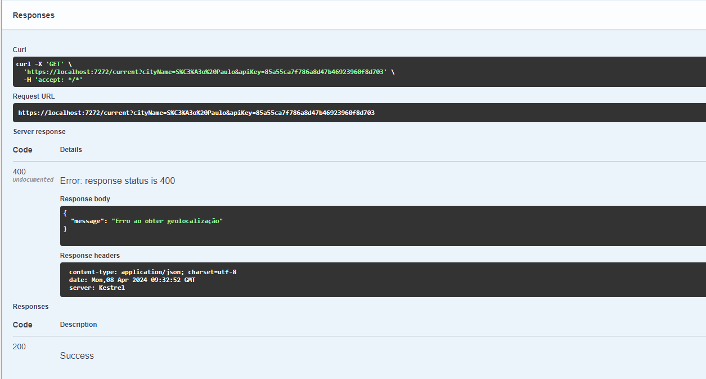

# Aplicativo de Previsão do Tempo

## Visão Geral

Este repositório contém uma API em .NET que consome APIs externas de previsão do tempo, do site OpenWeatherMap, para exibir a previsão do tempo para uma cidade específica inserida pelo usuário. A aplicação é capaz de mostrar a previsão do tempo atual, além de previsões para os próximos 5 dias.

## Requisitos Funcionais

1. **Endpoint para Consulta de Previsão do Tempo Atual:** A aplicação deve permitir ao usuário inserir o nome de uma cidade e, em seguida, exibir a previsão do tempo atual para essa cidade, incluindo temperatura, umidade, descrição do tempo (ensolarado, nublado, etc.), e velocidade do vento.
2. **Endpoint para Previsão do Tempo Estendida:** Além da previsão atual, a aplicação deve oferecer uma opção para visualizar a previsão estendida para os próximos 5 dias, mostrando as condições diárias esperadas.
3. **Endpoint para Histórico de Buscas:** A aplicação deve permitir que o histórico de buscas seja consultado, retornando o resumo das ultimas regiões visualizadas.

## Requisitos Não Funcionais

1. **Configuração:** Permitir que a chave API necessária para a consulta da API externa seja configurada facilmente, sem necessidade de alterações no código.
2. **Tratamento de Erros:** Implementar tratamento adequado de erros, incluindo erros de rede e erros retornados pela API externa.
3. **Cache:** Implementar Cache com banco de dados SQL para que as consultas feitas sejam armazenadas e que sejam evitadas novas chamadas para API.
4. **Testes unitários:** Implementar testes unitários com pelo menos 50% de cobertura.
5. **Serviço em Background para limpar o cache:** Criar um serviço em background que limpe o cache a cada 1h.

## Decisões Técnicas

1. **Implementação da arquitetura hexagonal:** As interações desta api são: banco de dados de persistência do histórico, banco de cache, consumo de apis externas e interface de api. Concluí que essas interações com serviços externos se encaixam bem como adaptadores da arquitetura hexagonal, e a implementação desta arquitetura abre espaço para adicionarmos outras interações sem muita dificuldade como exemplo: um adaptador para observabilidade.
2. **Propriedade Limit da api geocoding:** Para sermos práticos, o endpoint da api externa que fornece os dados da latitude e longitude a partir do nome da cidade retorna apenas 1 ocorrência do nome digitado.
3. **Intervalo da previsão extendida:** O endpoint que retorna os dados da previsão para os próximos 5 dias retorna a temperatura para cada 3h dos próximos 5 dias.
4. **SQL Server InMemory:** Com a finalidade de abstrair esforços com infraestrutura de banco de dados e focar na criação da api decidi pelo uso de banco de dados InMemory. Desta forma, os dados persistidos possuem o escopo da execução desta api.

## Uso da Aplicação

Para testar a funcionalidade desta API, primeiro devemos clonar este repositório e escolher o projeto WeatherForecastApi como projeto de inicialização. Depois, devemos criar uma conta gratuita e obter uma chave de api no menu "My API keys" do site: https://home.openweathermap.org/users/sign_up. Em seguida, executamos a aplicação (que abrirá uma página do Swagger no navegador) e executamos as chamadas passando a apiKey obtida. Para acessar os logs, basta acessar a janela cmd que será aberta quando a api estiver executando.

## Funcionamento

### Tela inicial


Ao executar o procedimento acima, pode demorar anguns instantes até a chave de api criada estar disponível para ser usada em uma chamada na api. Nesse caso, ao tentar realizar a chamada, esse será o retorno:



A solução para esse problema é aguardar alguns instantes até que o site OpenWeather disponibilize a chave.

### Exemplo de chamada para a consulta do clima atual


#### Exemplo de retorno:

```
	{
	  "cidade": "São Paulo",
	  "temperatura": 19.5,
	  "umidade": 92,
	  "descricao": "nublado",
	  "velocidade_do_vento": 3.6,
	  "unidades_de_medida": "Sistema Métrico"
	}
```

### Exemplo de chamada para a consulta da previsão para os próximos 5 dias


#### Exemplo de retorno:

```
    {
      "cidade": "São Paulo",
      "unidades_de_medida": "Sistema Métrico",
      "listaDePrevisoes": [
        {
          "data": "2024-04-08 12:00:00",
          "temperatura": 20.6,
          "umidade": 84,
          "descricao": "nublado",
          "velocidade_do_vento": 2.15
        },
        {
          "data": "2024-04-08 15:00:00",
          "temperatura": 25.5,
          "umidade": 60,
          "descricao": "nublado",
          "velocidade_do_vento": 2.3
        },
        {
          "data": "2024-04-08 18:00:00",
          "temperatura": 28.47,
          "umidade": 45,
          "descricao": "nublado",
          "velocidade_do_vento": 1.8
        },
        
        ...

        {
          "data": "2024-04-13 09:00:00",
          "temperatura": 20.25,
          "umidade": 91,
          "descricao": "chuva leve",
          "velocidade_do_vento": 2.86
        }
      ]
    }
```

### Exemplo de chamada para a consulta do histórico de buscas


#### Exemplo de retorno:

```
    [
      {
        "cidade": "São Paulo",
        "data": "08/04/2024 06:32:52 -03:00"
      },
      {
        "cidade": "São Paulo",
        "data": "08/04/2024 06:33:57 -03:00"
      },
     
      ...

      {
        "cidade": "Santo André",
        "data": "08/04/2024 06:40:14 -03:00"
      }
    ]
```

### Exemplo de consulta de logs


*OBS:* Repare que as logs mostram o comportamento do cache e do serviço de limpeza do cache em 2º plano